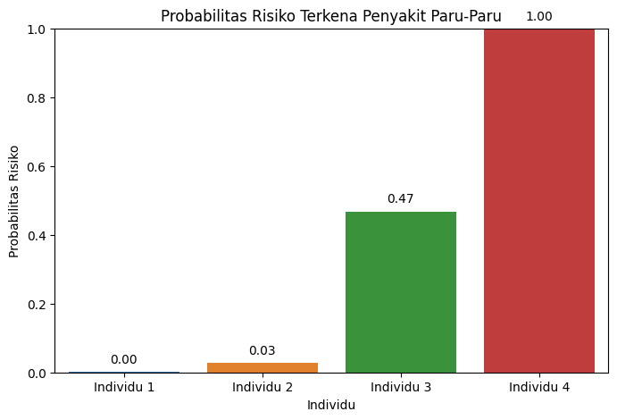
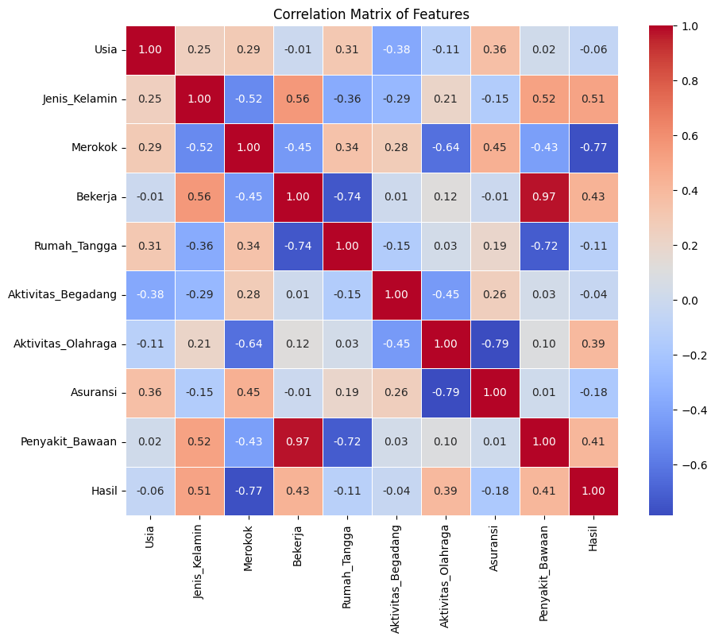

# Probabilitas Risiko Penyakit Paru-Paru

Proyek ini bertujuan untuk memprediksi risiko terkena penyakit paru-paru menggunakan dataset yang tersedia di Kaggle. Model yang digunakan adalah regresi logistik, dan hasil prediksi divisualisasikan menggunakan grafik batang dan matriks korelasi.

### Sumber Dataset

Dataset yang digunakan dapat diakses melalui tautan berikut:
[Kaggle: DATASET PREDIC TERKENA PENYAKIT PARU-PARU](https://www.kaggle.com/datasets/andot03bsrc/dataset-predic-terkena-penyakit-paruparu)

### Catatan

Proyek ini hanya untuk tujuan edukasi, sehingga hasil prediksi mungkin tidak sesuai keadaan sebenarnya.

### Langkah-langkah

1. **Memuat Dataset**

- Dataset dimuat dari file CSV menggunakan `pandas`.

2. **Pra-pemrosesan Data**

- Data kategori diubah menjadi numerik menggunakan `LabelEncoder`.

3. **Pembagian Data**

- Data dibagi menjadi data latih dan data uji menggunakan `train_test_split`.

4. **Pembangunan Model**

- Model regresi logistik dibangun dan dilatih menggunakan data latih.

5. **Evaluasi Model**

- Model dievaluasi menggunakan metrik akurasi, ROC-AUC, dan laporan klasifikasi.

6. **Prediksi Risiko Individu**

- Model digunakan untuk memprediksi risiko pada data baru.

7. **Visualisasi**

- Probabilitas risiko divisualisasikan menggunakan grafik batang.
- Matriks korelasi divisualisasikan menggunakan heatmap.

### Kesimpulan

- **Individu 1**: Risiko 0.00 - Tidak memiliki faktor risiko signifikan.
- **Individu 2**: Risiko 0.03 - Risiko sangat rendah.
- **Individu 3**: Risiko 0.47 - Risiko sedang.
- **Individu 4**: Risiko 1.00 - Risiko maksimal.

### Kesimpulan Umum

Individu dengan lebih banyak faktor risiko (seperti merokok, penyakit bawaan, dan kurang aktivitas fisik) memiliki probabilitas lebih tinggi untuk terkena penyakit paru-paru. Sebaliknya, individu dengan pola hidup sehat memiliki risiko lebih rendah.

### Korelasi dengan Variabel Target (Hasil)

- **Merokok (-0.77)**: Korelasi negatif kuat.
- **Penyakit Bawaan (0.41)**: Korelasi positif.
- **Aktivitas Olahraga (0.39)**: Korelasi positif.

### Korelasi Antar Fitur Lainnya

- **Merokok dan Aktivitas Olahraga (-0.64)**: Korelasi negatif.
- **Jenis Kelamin dan Bekerja (0.56)**: Korelasi positif.
- **Penyakit Bawaan dan Bekerja (0.97)**: Korelasi positif.

### Implikasi Korelasi

Matriks korelasi memberikan wawasan tentang pola-pola yang relevan di antara faktor risiko dan dapat digunakan untuk merancang langkah-langkah intervensi kesehatan yang lebih spesifik.

### Visualisasi

- **Probabilitas Risiko Terkena Penyakit Paru-Paru**
  

- **Correlation Matrix of Features**
  

### Kontribusi

Kontribusi sangat diterima. Silakan fork repositori ini dan buat pull request dengan perubahan yang diusulkan.
